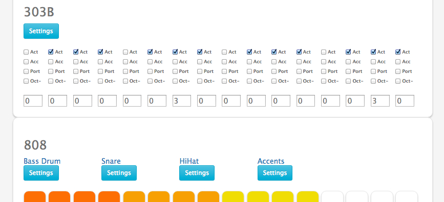

ReBjorn
=================



A recreation of the clasic Roland 303, 808 and 909. Built with Web Audio, Angular, Node, and vanilla Javascript.

This IN PROGRESS web app is built and named for the infamous ReBirth software, by Propellerheads.

A full tutorial will be found [here](http://tohmjudson.com) (coming soon).

A note to code junkies: The code here is in progress, is rather ugly, and needs work. As it is, it works, but I am in process of fixing it up. In particular, I have found that working in Angular and Web Audio to be a little tricky, thus there is a 303a and 303b. That is the next major hurdle.  Any help would be VERY welcome!

Installing and Running
----

Install [Node.js](http://nodejs.org/).

Clone GitHub repo:

```
https://github.com/tohmjudson/ReBjorn.git
```

Install the node module dependencies:

```
npm install
```

Run the application:

```
npm start
```

Go to [http://localhost:3000](http://localhost:3000) in your browser.

Resources
----

References
----
